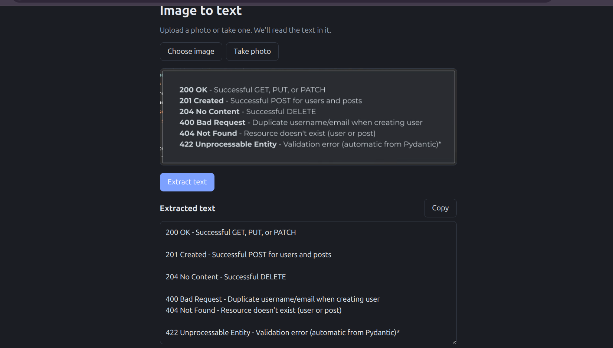

# Text Extracter

A small web app that extracts text from images. Upload a photo or take one with your camera, and the app reads the text in it using OCR.

**Stack:** React (Vite) · FastAPI · Tesseract OCR


## Screenshots

<!-- Save your screenshot as screenshots/app.png, then this image will show up. -->


## How it works

```
Upload or take photo → React → FastAPI → Pillow (convert) → Tesseract (OCR) → text back to React → displayed to user
```

## Features

- Upload an image or take a photo (camera on mobile)
- Image preview before extraction
- Automatic fix for phone-camera rotation and conversion to grayscale
- Editable result with a copy button
- Clear error messages (unreadable file, file over 10 MB, no text found)

## Project structure

```
text_extracter/
├── backend/
│   ├── main.py            # FastAPI app and OCR endpoint
│   ├── pyproject.toml     # Python dependencies (uv)
│   └── uv.lock
└── frontend/
    ├── index.html
    ├── package.json
    ├── vite.config.js
    └── src/
        ├── main.jsx
        ├── App.jsx        # UI and API call
        └── App.css
```

## Prerequisites

- [Python](https://www.python.org/) 3.10+
- [uv](https://docs.astral.sh/uv/) (Python package manager)
- [Node.js](https://nodejs.org/) 18+
- [Tesseract OCR](https://github.com/tesseract-ocr/tesseract) engine

Install Tesseract:

| OS | Command |
| --- | --- |
| Ubuntu/Debian | `sudo apt install tesseract-ocr` |
| macOS | `brew install tesseract` |
| Windows | Use the [installer](https://github.com/UB-Mannheim/tesseract/wiki) and add it to your PATH |

Check it works with `tesseract --version`.

## Getting started

### 1. Clone the repository

```bash
git clone <https://github.com/Ndungu-Jn/text_extracter>
cd text_extracter
```

### 2. Run the backend

```bash
cd backend
uv sync
uv run fastapi dev main.py
```

The API runs at http://localhost:8000. Interactive docs are at http://localhost:8000/docs.

### 3. Run the frontend

In a second terminal:

```bash
cd frontend
npm install
npm run dev
```

Open http://localhost:5173.

## API

### `POST /api/ocr`

Accepts an image as `multipart/form-data` (field name: `file`).

**Response**

```json
{ "text": "Extracted text here" }
```

**Errors**

| Status | Meaning |
| --- | --- |
| 413 | Image is larger than 10 MB |
| 415 | File is not a readable image |
| 500 | Tesseract is not installed on the server |

## Configuration

- **CORS:** the backend only accepts requests from `http://localhost:5173`. If your frontend runs on another port or domain, update `allow_origins` in `backend/main.py`.
- **API URL:** the frontend calls `http://localhost:8000` by default. Set `VITE_API_URL` in a `frontend/.env` file to change it.
- **Windows:** if Tesseract isn't found, add this to `main.py` after the imports:
```python
  pytesseract.pytesseract.tesseract_cmd = r"C:\Program Files\Tesseract-OCR\tesseract.exe"
```

## Troubleshooting

| Problem | Fix |
| --- | --- |
| "Tesseract is not installed on the server" | Install Tesseract and make sure `tesseract --version` works in your terminal |
| "Can't reach the server" | Check the backend is running on port 8000 |
| CORS error in the browser console | Vite started on a different port; update `allow_origins` in `main.py` |
| Empty or wrong result | Use a sharp, well-lit image with dark text on a light background |

